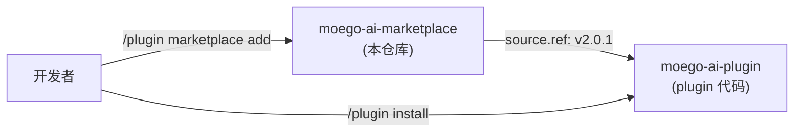

# CLAUDE.md

MoeGo 研发团队 Claude Code Plugin Marketplace 配置仓库。仅存放 `marketplace.json`，不含 plugin 代码。

## 仓库职责

本仓库是 plugin 分发目录，告诉 Claude Code "去哪里拉取 plugin"。实际 plugin 代码在 `MoeGolibrary/moego-ai-plugin`。

## 关键文件

- `.claude-plugin/marketplace.json` — marketplace 配置（唯一核心文件）
- `README.md` — 安装说明

## 分支策略

- 默认分支：`production`（Claude Code 拉取此分支）
- 开发分支：`chore-xxx` / `feature-xxx` → PR 合入 production

## 版本联动

marketplace.json 中 plugin 条目的 `version` 和 `ref` 必须与 plugin 仓库的 `plugin.json version` 和 git tag 一致。

更新流程：
1. plugin 仓库合入代码 → bump version → 打 tag
2. 本仓库更新 marketplace.json 的 `version` + `ref` → PR 合入 production

## 提交规范

- 格式：`chore: <description> ENT-0`
- 分支命名：`chore-xxx`
- production 分支有 PR 保护，不可直接 push
